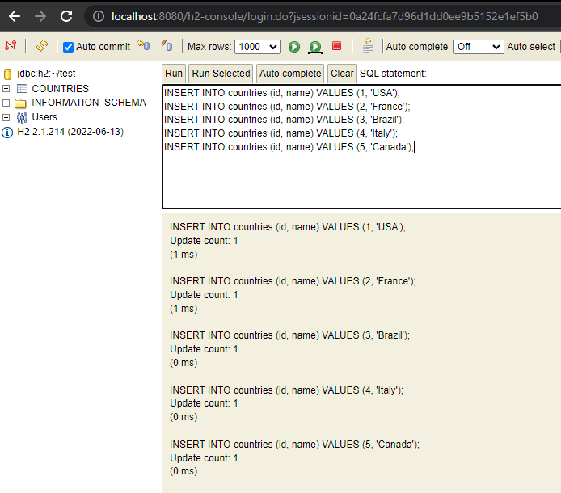

### Escuela Colombiana de Ingeniería

### IETI - Persistencia en Memoria con H2

### Autor: Diego Leon

#### Descripción

- Modificamos aplication.properties para que se conecte a la base de datos H2 con url jdbc:h2:~/test
  

- Accedemos a la base de datos con la url http://localhost:8080/h2-console

- Creamos la tabla Countries
  

- Insertamos datos en la tabla Countries

- Hacemos una consulta a la tabla Countries
  
